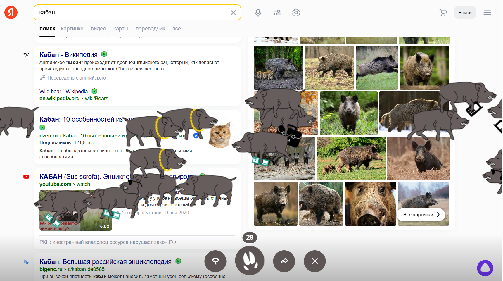

# Кабан

Это простой скрипт на Python который тапает кабанов вместо вас.



## Что вам нужно сделать?
1) Для начала вам необходимо установить python: https://www.python.org/downloads.
2) После скачайте этот проект и установите зависимости:\
``` pip install -r "requirements.txt" ```
3) Зайдите в `boar.py` и поменяйте параметры:
```
YANDEX_USERNAME = "username"  # Ваш юзернеём от кабинета Yandex
TAP_COUNT = 4000              # Кол-во тапов по кабанам
```
